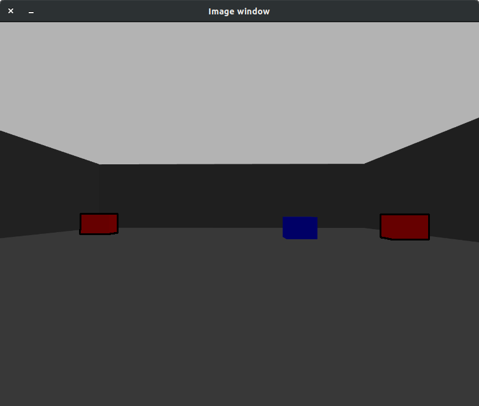
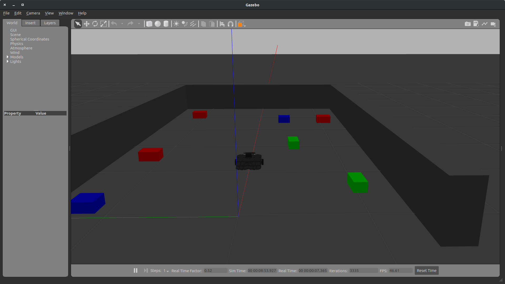

# Turtlebot3 Part1
[](https://opensource.org/licenses/BSD-3-Clause)

## Overview
In this project I have simulated a Turtlebot3 in a sample world I made in Gazebo. I have used the data published from the /camera topic and /scan topic of the Turtlebot3 to do red object detection and obstacle avoidance respectively. I am also publishing to the /cmd_vel topic to make it move.

## Result
Output of camera topic with only red objects detected:


A picture of the gazebo environment


## Software
* Ubuntu 18.04
* ROS melodic. To install, use this [link](http://wiki.ros.org/melodic/Installation/Ubuntu)

## Catkin workspace
This code has to run in a catkin workspace. If you don't have a catkin workspace created use the following command to create one:
```
mkdir -p ~/catkin_ws/src
```
If you already have a catkin workspace or have created one using the above line then:
```
cd ~/catkin_ws/
catkin_make
source devel/setup.bash
```

## Packages
> * OpenCV
> * Turtlebot3

### OpenCV Installation
* #### Installing Dependencies
  In a terminal run the following commands:
  ```
  sudo apt install build-essential cmake git pkg-config libgtk-3-dev \
    libavcodec-dev libavformat-dev libswscale-dev libv4l-dev \
    libxvidcore-dev libx264-dev libjpeg-dev libpng-dev libtiff-dev \
    gfortran openexr libatlas-base-dev python3-dev python3-numpy \
    libtbb2 libtbb-dev libdc1394-22-dev

  sudo apt-get install build-essential checkinstall cmake pkg-config yasm gfortran git
  sudo apt-get install libjpeg8-dev libjasper-dev libpng12-dev
  ```
* #### Downloading and Installing
  ```
  git clone https://github.com/opencv/opencv.git
  git clone https://github.com/opencv/opencv_contrib.git
  ```
  At the time of install, OpenCV version 4.2.0 was available
  ```
  cd opencv
  mkdir build && cd build
  cmake -D CMAKE_BUILD_TYPE=RELEASE \
      -D CMAKE_INSTALL_PREFIX=/usr/local \
      -D INSTALL_C_EXAMPLES=ON \
      -D WITH_TBB=ON \
      -D WITH_V4L=ON \
      -D WITH_QT=ON \
      -D OPENCV_EXTRA_MODULES_PATH=../../opencv_contrib/modules \
      -D BUILD_EXAMPLES=ON ..

  # find out number of CPU cores in your machine
  nproc

  # substitute 4 by output of nproc
  make -j4
  sudo make install
  sudo sh -c 'echo "/usr/local/lib" >> /etc/ld.so.conf.d/opencv.conf'
  sudo ldconfig
  ```

### Turtlebot3 packages
You will need certain packages of Turtlebot3 for this project. They can be added using the following commands:
```
cd <catkin workspace>
source devel/setup.bash
cd src/
git clone -b melodic-devel https://github.com/ROBOTIS-GIT/turtlebot3_simulations.git
git clone -b melodic-devel https://github.com/ROBOTIS-GIT/turtlebot3_msgs.git
git clone -b melodic-devel https://github.com/ROBOTIS-GIT/turtlebot3.git
cd ..
catkin_make
```

## Building the project
Using the following command clone the repository:
```
git clone https://github.com/Chinj17/turtlebot3_part1.git
```
Copy all the files to your src/ folder inside your catkin workspace. To do this using the terminal do the following:
```
cd <path to repository>
cp -r mobile_robot /home/<User>/<catkin workspace>/src
cp -r image_read /home/<User>/<catkin workspace>/src
```
